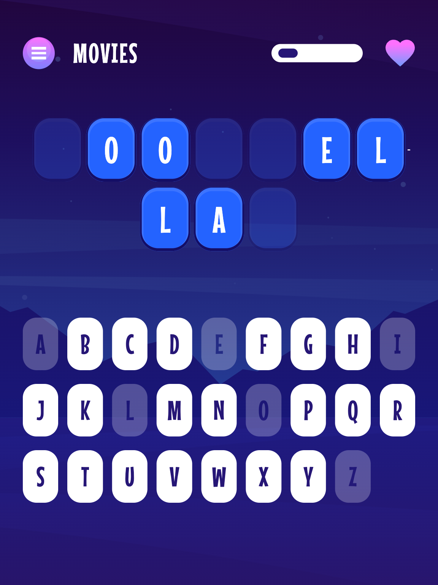

# Frontend Mentor - Hangman game solution

This is a solution to the [Hangman game challenge on Frontend Mentor](https://www.frontendmentor.io/challenges/hangman-game-rsQiSVLGWn). Frontend Mentor challenges help you improve your coding skills by building realistic projects.

## Table of contents

- [Overview](#overview)
  - [The challenge](#the-challenge)
  - [Screenshot](#screenshot)
  - [Links](#links)
- [My process](#my-process)
  - [Built with](#built-with)
  - [What I learned](#what-i-learned)
- [Usage](#usage)
- [Author](#author)

## Overview

### The challenge

Users should be able to:

- Learn how to play Hangman from the main menu.
- Start a game and choose a category.
- Play Hangman with a random word selected from that category.
- See their current health decrease based on incorrect letter guesses.
- Win the game if they complete the whole word.
- Lose the game if they make eight wrong guesses.
- Pause the game and choose to continue, pick a new category, or quit.
- View the optimal layout for the interface depending on their device's screen size.
- See hover and focus states for all interactive elements on the page.
- Navigate the entire game only using their keyboard.

### Screenshot



### Links

- Solution URL: https://github.com/stefan-holmgren/fem-hangman-game
- Live Site URL: https://stefan-holmgren.github.io/fem-hangman-game/

## My process

### Built with

- Semantic HTML5 markup
- CSS custom properties
- Flexbox
- CSS Grid
- Mobile-first workflow
- [Typescript](https://www.typescriptlang.org/)
- [Solid.js](https://www.solidjs.com/)

### What I learned

Decided to use Solid.js for this project to learn more about it. It was a good experience and I will probably use it again in the future.

Also went and tried using SASS for styling, and modular CSS. Also interesting.

The hardest part, which took me the longest, was to figure out how to have the secret text adapt to its confines. Was searching the web for all kinds of CSS only solutions, but totally failed in the end. So I decided to use a `scale-factor` css variable that shrank the text until they fit (according to javascript). The easiest way to see if the content fit its container was to check if `scrollHeight` was larger than `clientHeight` and if so, scale it down a bit. And then keep doing this until it fit. Not the most elegant solution, but it works.

The next hardest part was to make the game controllable from keyboard:

- **Home page**

  - Arrow keys for traversing the menu.
  - Enter or space to activate the selected menu item.

- **How to play**

  - Escape to go back to home page

- **Pick category**

  - Arrow keys to traverse the categories.
  - Escape to go back to home page

- **Game**

  - Escape to pause the game.
  - Keyboard alphabet to select a letter.
  - Arrow keys to traverse the alphabet.
  - Enter or space to select a letter.
  - Escape to go back to home page

- **Pause menu**

  - Arrow keys to traverse the menu.
  - Enter or space to activate the selected menu item.

- **Win/lose screen**
  - Arrow keys to traverse the menu.
  - Enter or space to activate the selected menu item.

Some of the content can be too large in the "how to play" page, and "pick category" pages. So I made the page scrollable.

## Usage

```bash
$ npm ci
```

In the project directory, you can run:

### `npm run dev`

Runs the app in the development mode.<br>
Open http://localhost:5173/fem-hangman-game to view it in the browser.

## Author

- Website - [Add your name here](https://www.your-site.com)
- Frontend Mentor - [@yourusername](https://www.frontendmentor.io/profile/yourusername)
- Twitter - [@yourusername](https://www.twitter.com/yourusername)
